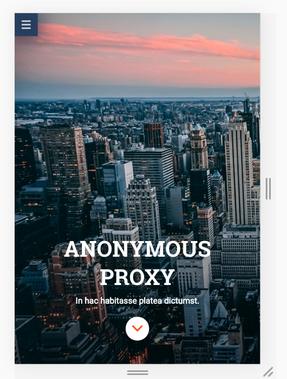
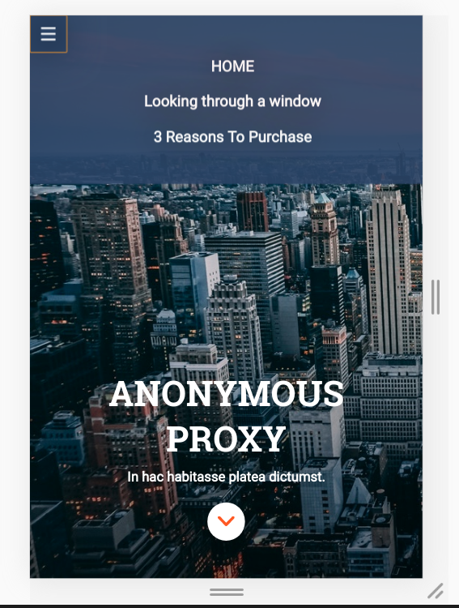

# Anonymous Proxy

Responsive website. HTML5,CSS3. Ready for mobile, tablet & desktop browsers.
Some of the tools used for this project are:
- Grid
- HTML
- CSS
- SASS
- Animations & Transitions
- Gulp
- Terminal
- Git & Github
- Zeplin

This website is to provide the knowledge that I get after studying the first Module of Adalab's course. 
Here you can find all the info about the module:
https://books.adalab.es/materiales-front-end-g/modulo-1.-hola-mundo/1_1_intro_a_la_web

Some of the references I have consulted are: 
- https://css-tricks.com/snippets/css/a-guide-to-flexbox/
- https://developer.mozilla.org/es/
- http://www.mclibre.org/consultar/htmlcss/html/html-formularios.html

If you want to tell me something about this project, don't hesitate to contact me: http://laurapareja.com
